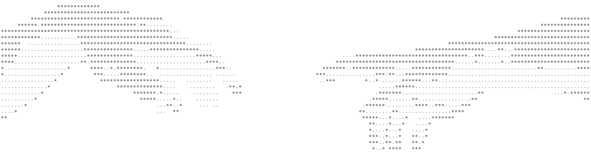

# Hi, I'm Nick 👋

## About Me

I am an engaging, confident, and highly motivated individual with career aspirations in software engineering and embedded systems. As a Technology & Software Architect, I have hands-on experience in full-stack web development, UX/UI design, and AI system development. I focus on building scalable and efficient software solutions that enhance both functionality and user experience. Currently pursuing a Master of Computer Science (Software Engineering), I am passionate about leveraging emerging technologies to drive innovation, solve complex challenges, and shape a more dynamic future at the intersection of creativity and engineering.
